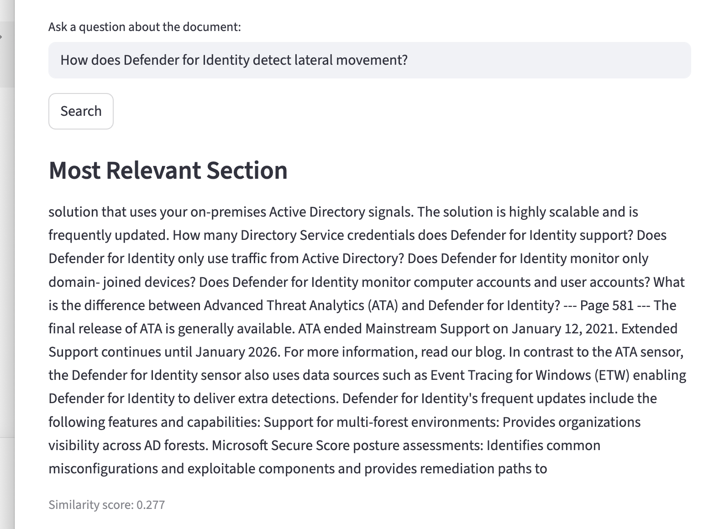
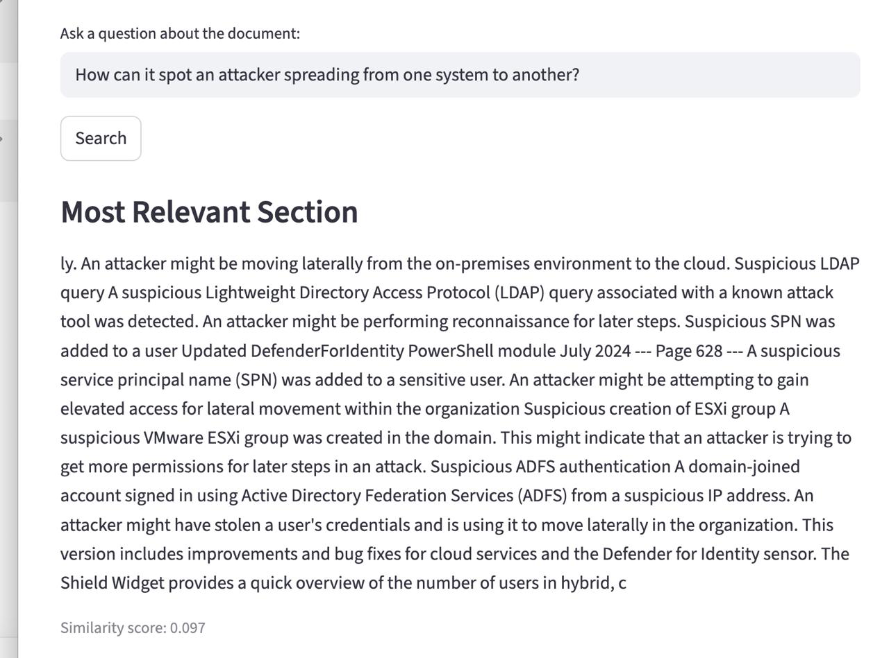

# Version 1 — Manual Retrieval Validation

## Purpose

This record captures the manual tests that established the limitation which
Version 2 was designed to address.

Version 1 uses the following retrieval-only workflow:

```text
PDF → chunks → TF-IDF vectors → cosine similarity → one retrieved chunk
```

It does not generate an answer, use embeddings, or use an LLM.

## Test Setup

- Date: 2026-08-09
- Application: Document Assistant V1, running locally through Streamlit
- Knowledge source: Microsoft Defender for Identity documentation used during V1
  development
- Retrieval: TF-IDF with English stop-word removal and cosine similarity
- Result policy: return one chunk with the highest lexical similarity score

## Results

| Test | Question type | Retrieved score | Observed result | Learning outcome |
| --- | --- | --- | --- | --- |
| 1 | Uses document terminology | 0.277 | Returned a general Defender for Identity FAQ/features section rather than a direct lateral-movement explanation. | A higher TF-IDF score did not guarantee semantic relevance. |
| 2 | Uses paraphrased wording | 0.097 | Returned a passage that explicitly described an attacker moving laterally. | A lower TF-IDF score could still retrieve more relevant evidence. |

## Test 1 — Direct Terminology

Question:

```text
How does Defender for Identity detect lateral movement?
```

The query shares important words with the document, and the retrieved chunk has
a similarity score of `0.277`. However, the visible section is primarily a
general product/FAQ passage. It does not provide a focused answer to the
lateral-movement question.



## Test 2 — Paraphrased Wording

Question:

```text
How can it spot an attacker spreading from one system to another?
```

This query does not use the exact phrase `lateral movement`. Its score is only
`0.097`, but the returned chunk explicitly includes the idea that an attacker
may be moving laterally.



## Findings

1. Version 1 successfully executes classical document retrieval: it reads the
   PDF, ranks chunks, returns one result, and shows the score.
2. TF-IDF mainly rewards lexical word overlap. It cannot reliably tell whether a
   result expresses the meaning of the question.
3. The numerical similarity score is a ranking signal, not an answer-confidence
   score. A larger score can still be less useful to the user.
4. Returning only one raw chunk leaves synthesis work to the user.

## Architectural Consequence

These observations motivated the Version 2 decision to replace TF-IDF vectors
with embeddings, retrieve multiple semantically related chunks, and generate a
grounded answer. See V2's `ADR-002-use-semantic-retrieval.md` for that decision.

## Limitations

This is a two-question qualitative validation, not a benchmark. It does not
measure recall, precision, latency, or behavior across a representative test
set. It also does not include a saved unsupported-question test for V1.
