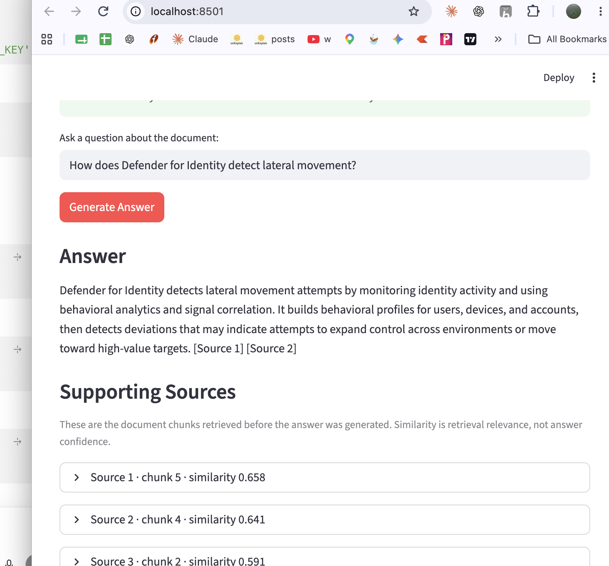
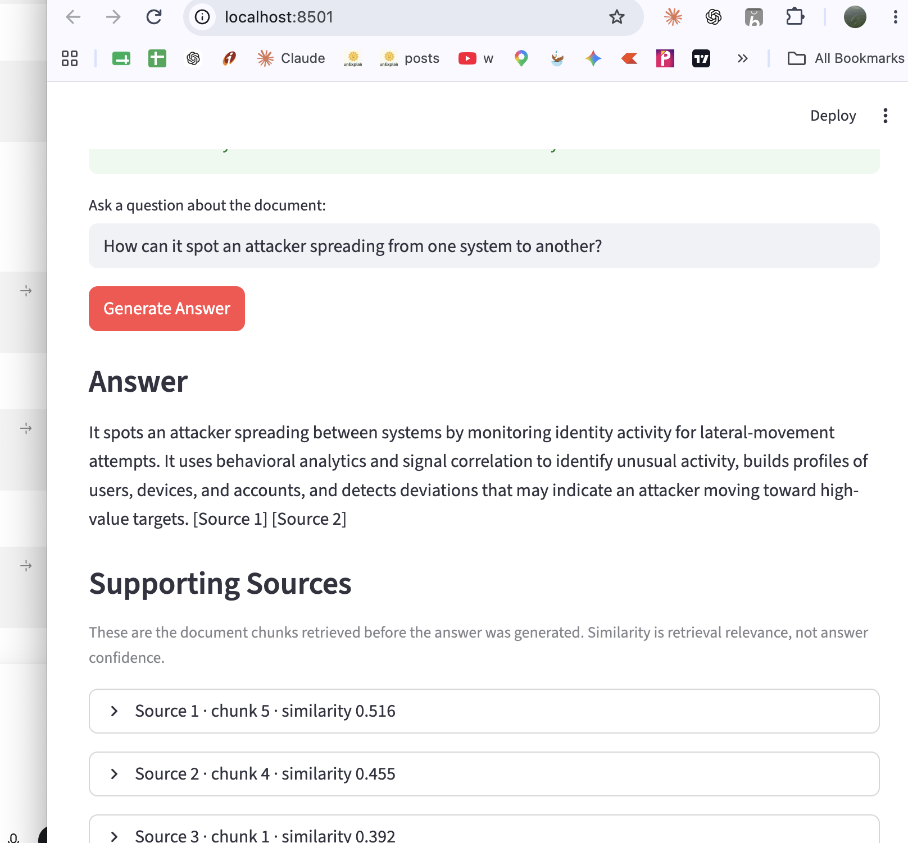
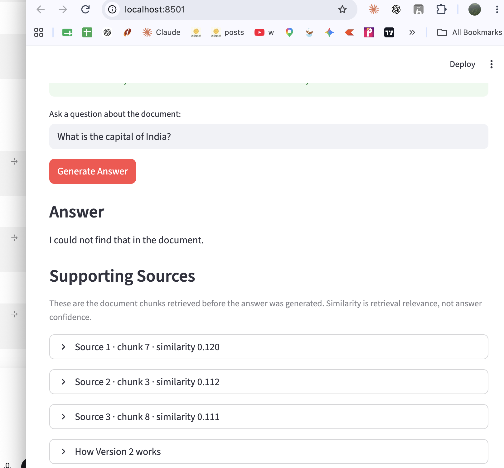

# Version 2 — Manual RAG Validation

## Purpose

This record captures a small manual validation of Version 2's end-to-end RAG
workflow:

```text
PDF → chunks → embeddings → semantic retrieval → grounded prompt → LLM answer
```

It is evidence that the application was exercised with a real OpenAI API key.
It is not a statistical benchmark or a substitute for automated evaluation.

## Test Setup

- Date: 2026-08-09
- Application: Document Assistant V2, running locally through Streamlit
- Knowledge source: the configured four-page Microsoft Defender for Identity PDF
- Indexed document chunks: 8
- Retrieval: `text-embedding-3-small`, cosine similarity, top 3 chunks
- Generation: `gpt-5.6-terra`

## Results

| Test | Question type | Top retrieval scores | Observed result | Outcome |
| --- | --- | --- | --- | --- |
| 1 | Direct terminology | 0.658, 0.641, 0.591 | Explained identity monitoring, behavioral analytics, signal correlation, and anomalous activity; cited Sources 1 and 2. | Pass |
| 2 | Paraphrased terminology | 0.516, 0.455, 0.392 | Reached the same grounded explanation for an attacker spreading between systems; cited Sources 1 and 2. | Pass |
| 3 | Unsupported question | 0.120, 0.112, 0.111 | Responded: `I could not find that in the document.` | Pass |

## Test 1 — Direct Question

Question:

```text
How does Defender for Identity detect lateral movement?
```

The assistant retrieved chunks 5, 4, and 2, then generated a cited answer about
identity monitoring, behavioral analytics, and signal correlation.



## Test 2 — Paraphrased Question

Question:

```text
How can it spot an attacker spreading from one system to another?
```

The wording does not use the document's phrase `lateral movement`, yet the
assistant retrieved related chunks (5, 4, and 1) and produced the same grounded
explanation.



## Test 3 — Unsupported Question

Question:

```text
What is the capital of India?
```

The assistant still retrieved three weakly related chunks because the retrieval
step always returns the top three candidates. The grounded prompt caused the LLM
to abstain rather than answer using outside knowledge.



## Findings

1. The paraphrased question produced lower similarity scores than the direct
   wording, but it still retrieved overlapping relevant chunks and reached a
   correct document-grounded answer. This is the practical benefit of semantic
   retrieval over V1's exact-word-oriented TF-IDF retrieval.
2. Similarity is useful for ranking chunks, not for declaring an answer correct.
   The successful paraphrase had a lower top score than the direct question.
3. A low-score retrieval does not by itself prevent the LLM from answering. The
   grounding instruction is what led the model to correctly state that the
   unsupported answer was absent from the document.
4. Showing the retrieved chunks and citations makes each answer inspectable.

## Limitations and Next Step

This is a three-question qualitative smoke test over one document. It does not
measure retrieval recall, answer faithfulness, latency, cost, or behavior across
many documents. Those evaluation and operational concerns are addressed by the
Version 3 testing and observability direction.
