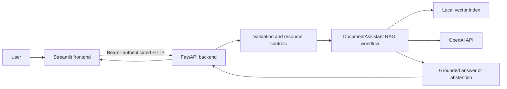

# Enterprise Document Assistant — Version 3

Version 3 turns the working RAG assistant from Version 2 into a small,
engineerable service. It keeps the AI pipeline visible, then surrounds it with
validation, access control, resource protection, predictable failures,
observability, tests, containers, and CI.

This repository is intentionally both:

- a working document assistant;
- a reusable reference architecture for future AI-backed applications.

## The Three-Version Story

```text
V1 — Information Retrieval
PDF -> chunks -> TF-IDF -> cosine similarity -> retrieved passage

V2 — Generative AI
PDF -> chunks -> embeddings -> semantic retrieval -> prompt -> LLM -> answer

V3 — Production Engineering
Client -> protected API -> validated RAG service -> observable, tested response
```

The primary architectural shift in V3 is not a different LLM. It is the
introduction of clear engineering boundaries around the preserved V2
capability.

## What the Application Does

An authorized user asks a question about one configured PDF. The system:

1. validates the request;
2. authenticates the application client;
3. applies rate and concurrency limits;
4. converts the question into an embedding;
5. retrieves semantic candidates from the document index;
6. reranks the candidates;
7. checks whether the evidence is strong enough;
8. either abstains or asks the LLM to answer only from that evidence;
9. returns the answer, supporting sources, and a request ID.



The configured `document.pdf` is the only knowledge source.

## A Beginner-Friendly Mental Model

Imagine a carefully operated research desk:

| Mental model | Engineering component | Exact responsibility |
| --- | --- | --- |
| Reception desk | FastAPI | Receives HTTP requests and returns HTTP responses |
| Credential check | Bearer authentication | Verifies the caller knows the application key |
| Form checker | Pydantic | Rejects invalid or unexpected request data |
| Admission policy | Rate limiter | Limits how often one client can request costly work |
| Kitchen capacity | Concurrency semaphore | Caps expensive workflows running at the same time |
| Coordinator | `DocumentAssistant` | Runs the question workflow in the correct order |
| Library index | Vector store | Holds chunks and embeddings for semantic search |
| Researcher | Candidate retrieval | Finds a broad evidence shortlist |
| Reviewer | Reranker | Refines the shortlist before generation |
| Evidence policy | Grounding gate | Answers only when evidence is sufficient |
| Writer | LLM | Converts selected evidence into a concise answer |
| Escalation process | Error handlers | Produces stable failures without leaking internals |
| Audit trail | Logs and request IDs | Makes each request diagnosable |
| Quality review | Tests and evaluation | Proves contracts and observed RAG behavior |

Two important corrections keep this analogy technically accurate:

- Pydantic validates data; it does not authenticate a person.
- Rate limiting is admission control; it is not a durable message queue.

See [the full capability walkthrough](docs/capability-walkthrough.md).

## Why Each V3 Capability Exists

| Capability | V2 limitation it solves |
| --- | --- |
| FastAPI boundary | Streamlit owned UI, orchestration, and external calls in one process |
| Strict Pydantic models | Invalid inputs could reach costly processing |
| Separate application API key | Any reachable client could consume OpenAI credits |
| Rate limiting | One caller could create unbounded request volume |
| Concurrency semaphore | Too many simultaneous AI calls could overload the process |
| Async OpenAI client | Network waiting should not block the server unnecessarily |
| Centralized provider | Vendor calls, timeouts, and retries should not be scattered |
| Stable error contracts | Clients need predictable failure behavior |
| Request IDs and JSON logs | Operators need to correlate symptoms with execution |
| Health, readiness, and metrics | A running process is not always a ready service |
| Boundary-aware chunking | Fixed cuts can split an idea or sentence |
| Persistent vector snapshot | Unchanged restarts should not regenerate embeddings |
| Candidate retrieval and reranking | Gathering evidence and selecting evidence are different jobs |
| Evidence threshold | Weak retrieval should not automatically trigger generation |
| Tests and evaluation | Architecture claims need repeatable proof |
| Docker and CI | Runtime and verification should not depend on one laptop |

## Architecture at a Glance

```text
Browser
  -> Streamlit client
  -> authenticated FastAPI API
       -> strict request model
       -> authentication
       -> rate limiting
       -> request ID and metrics middleware
       -> DocumentAssistant
            -> concurrency limit
            -> PDF processing and chunking
            -> persistent local vector snapshot
            -> semantic candidate retrieval
            -> deterministic reranking
            -> evidence sufficiency check
            -> grounded prompt
            -> centralized OpenAI provider
       -> strict response model
```

Start with the [architecture guide](docs/architecture/README.md), then zoom from
the C4 context view down to the code view.

## Quick Start

Requirements:

- Python 3.9 or newer;
- an OpenAI API key with available credits;
- a text-based PDF named `document.pdf`;
- free local ports `8000` and `8501`.

```bash
python3 -m venv .venv
source .venv/bin/activate
python3 -m pip install -r requirements-dev.txt
cp .env.example .env
```

Generate the separate key used by the frontend to authenticate to the backend:

```bash
python3 -c "import secrets; print(secrets.token_urlsafe(32))"
```

Place the OpenAI key and generated application key in `.env`. Never commit that
file.

Terminal 1 — backend:

```bash
source .venv/bin/activate
python3 -m uvicorn app.main:create_app --factory --reload --reload-dir app
```

Terminal 2 — frontend:

```bash
source .venv/bin/activate
python3 -m streamlit run frontend/streamlit_app.py
```

Open `http://localhost:8501`. The API documentation is available at
`http://localhost:8000/docs`.

For the complete setup and first experiment, follow
[Getting Started](docs/getting-started.md).

## Expected First Experiment

Ask three kinds of questions:

1. a question using terminology found in the PDF;
2. the same idea expressed as a paraphrase;
3. a question unrelated to the PDF.

The first two should produce grounded answers with visible sources. The third
should return:

```text
I could not find that in the document.
```

This experiment demonstrates the system's three most important AI behaviors:
direct retrieval, semantic retrieval, and evidence-based abstention.

## Verification

Deterministic checks do not call OpenAI or consume credits:

```bash
python3 -m ruff check .
python3 -m pytest -q
```

With the backend running, the live evaluation calls the configured OpenAI
models and consumes a small amount of credit:

```bash
set -a
source .env
set +a
python3 scripts/evaluate.py
```

Current stored validation:

- lint passes;
- 36 automated tests pass;
- health, readiness, authentication, validation, metrics, and request-ID checks
  pass;
- all three live RAG cases pass.

See [Test Strategy](docs/testing.md) and
[Stored Test Evidence](docs/test-results/README.md).

## Repository Map

```text
v3-enterprise-assistant/
├── app/                    FastAPI application and production boundaries
│   └── services/           Document, retrieval, reranking, and OpenAI services
├── frontend/               Streamlit API client
├── evals/                  Small live RAG behavior dataset
├── scripts/                Operational and evaluation commands
├── tests/                  Deterministic unit, service, API, and UI tests
├── docs/
│   ├── architecture/       C4, lifecycle, and deployment views
│   ├── concepts/           Beginner AI and production concepts
│   ├── decisions/          Architecture Decision Records
│   └── test-results/       Stored validation evidence
├── Dockerfile              Reproducible non-root image
├── compose.yaml            Local two-service deployment
├── .env.example            Safe configuration template
└── VERSION                 Current version number
```

Each important folder has its own README explaining what belongs there and how
it should evolve.

## Documentation Paths

Choose the path that matches your goal:

| Goal | Start here |
| --- | --- |
| Run the project for the first time | [Getting Started](docs/getting-started.md) |
| Learn AI terminology from zero | [AI Foundations](docs/concepts/ai-foundations.md) |
| Understand the complete RAG pipeline | [RAG Pipeline](docs/concepts/rag-pipeline.md) |
| Understand V3 engineering controls | [Production Engineering](docs/concepts/production-engineering.md) |
| Understand the architecture | [Architecture Guide](docs/architecture/README.md) |
| Trace one request through the system | [Request Lifecycle](docs/architecture/request-lifecycle.md) |
| Use the HTTP API | [API Contract](docs/api.md) |
| Configure or tune the application | [Configuration](docs/configuration.md) |
| Read or modify the code | [Development Guide](docs/development.md) |
| Operate the service | [Runbook](docs/runbook.md) |
| Diagnose a problem | [Troubleshooting](docs/troubleshooting.md) |
| Understand security boundaries | [Security](docs/security.md) |
| Reuse this foundation elsewhere | [Reuse Blueprint](docs/reuse-blueprint.md) |
| Look up an unfamiliar term | [Glossary](docs/glossary.md) |

The complete index is in [Documentation Home](docs/README.md).

## Engineering Principles

V3 is frozen around eight reusable principles:

1. Validate everything entering the system.
2. Separate responsibilities.
3. Fail predictably.
4. Protect finite resources.
5. Keep external dependencies behind clients.
6. Trust evidence, not fluent model output.
7. Make failures observable without leaking data.
8. Prove behavior with tests and evaluation.

These are implementation rules, not slogans. Their exact code mapping is in
[Engineering Principles](docs/engineering-principles.md).

## Deliberate Boundaries

This is a strong single-instance reference application, not a claim of unlimited
enterprise scale.

- It answers from one configured text-based PDF.
- Authentication uses one shared application key, not user identity or OAuth.
- Search runs in memory and restores from a local JSON snapshot.
- Rate limits, metrics, and concurrency state are per process.
- The reranker is deterministic, not another model.
- Citations are instructed in the prompt and displayed with source chunks; they
  are not independently fact-checked.
- The three-case evaluation is a smoke set, not a statistical benchmark.
- Cloud deployment, TLS, managed secrets, and rollback require a chosen platform.

Redis, a managed vector database, enterprise identity, Kubernetes, multiple
agents, and model-controlled tools should be added only after a measured
requirement justifies them.

## Why Function Calling Is Not Included

Every supported request requires the same operation: search the configured PDF,
evaluate the evidence, and answer or abstain. There is no useful model routing
decision.

Function calling becomes justified when the system has multiple optional,
permission-controlled actions—such as searching documents, looking up a case,
and creating a ticket. Until then, deterministic orchestration is simpler,
safer, cheaper, and easier to test.

## Reuse Goal

The reusable 70% is the engineering shell:

- API boundary and contracts;
- validated configuration;
- provider isolation;
- authentication and resource controls;
- error taxonomy;
- structured observability;
- tests, evaluation structure, containerization, CI, ADRs, and runbooks.

The project-specific 30% is the knowledge source, document processing,
retrieval policy, prompts, evaluation cases, and user experience. Follow the
[Reuse Blueprint](docs/reuse-blueprint.md) when adapting V3 to a new domain.

## Version

`3.1.0`
