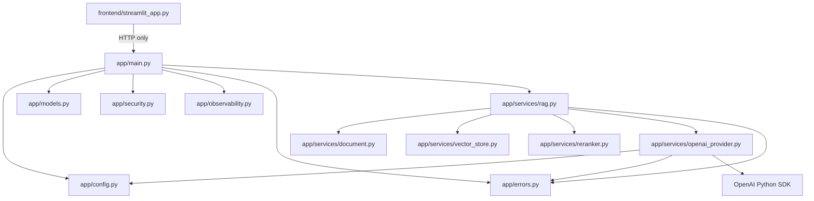

# C4 Level 4 — Code View

## Scope

The code view maps the component responsibilities to concrete Python modules,
classes, and functions.

## Dependency Diagram



## Important Code Elements

| Code element | File | Responsibility |
| --- | --- | --- |
| `create_app()` | `app/main.py` | Construct and wire FastAPI for runtime and tests |
| `Settings` | `app/config.py` | Validate environment configuration and secrets |
| `APIModel` | `app/models.py` | Provide strict, unknown-field-rejecting API models |
| `QuestionRequest` | `app/models.py` | Normalize and validate question text |
| `require_api_key()` | `app/security.py` | Authenticate bearer application credential |
| `InMemoryRateLimiter` | `app/security.py` | Enforce a locked per-process sliding window |
| `JsonFormatter` | `app/observability.py` | Emit structured privacy-safe logs |
| `MetricsCollector` | `app/observability.py` | Track small per-process operational metrics |
| `DocumentAssistant` | `app/services/rag.py` | Coordinate indexing, retrieval, grounding, generation |
| `AIProvider` | `app/services/rag.py` | Define the small provider contract used by the workflow |
| `build_prompt()` | `app/services/rag.py` | Create the grounded source-tagged prompt |
| `load_pdf()` | `app/services/document.py` | Validate and extract page text |
| `split_text()` | `app/services/document.py` | Create boundary-aware overlapping chunks |
| `document_fingerprint()` | `app/services/document.py` | Hash document content for cache invalidation |
| `InMemoryVectorStore` | `app/services/vector_store.py` | Hold, persist, restore, and search vectors |
| `rerank()` | `app/services/reranker.py` | Order semantic candidates with lexical evidence |
| `OpenAIProvider` | `app/services/openai_provider.py` | Isolate embeddings and Responses API calls |
| `evaluate_case()` | `scripts/evaluate.py` | Judge live grounded/abstention behavior |

## Dependency Rules

Allowed:

```text
frontend -> HTTP contract
API -> configuration, contracts, security, observability, application service
application service -> document, store, reranker, provider
provider -> OpenAI SDK
tests -> any internal seam required for verification
```

Avoid:

```text
frontend -> backend Python imports
document/vector/reranker -> FastAPI or Streamlit
routes -> direct OpenAI SDK calls
multiple modules -> duplicated environment reads or provider clients
provider -> Streamlit or HTTP response construction
```

## Testability Seams

`create_app(settings, assistant)` accepts explicit replacements. API tests
inject a fake assistant and exercise FastAPI without OpenAI.

`DocumentAssistant(settings, provider)` accepts an `AIProvider`. Service tests
inject a deterministic fake and exercise indexing, retrieval, grounding, and
concurrency without network calls.

These seams are dependency inversion at an appropriate scale; a full dependency
injection framework is unnecessary.

## Code Reading Order

For a new developer:

1. `app/models.py` — learn the external contract;
2. `app/main.py` — see routes and application wiring;
3. `app/services/rag.py` — understand the complete workflow;
4. `app/services/document.py` — understand indexing input;
5. `app/services/vector_store.py` — understand semantic search;
6. `app/services/reranker.py` — understand final evidence selection;
7. `app/services/openai_provider.py` — understand the provider boundary;
8. `app/security.py` and `app/observability.py` — understand production controls;
9. `tests/` — see executable examples of each contract.

## When to Update This View

Update the code view when modules are added, dependency direction changes, or a
new architectural seam is introduced. Small internal refactors that do not
change responsibilities do not require an ADR, but the table should still match
the current code.
