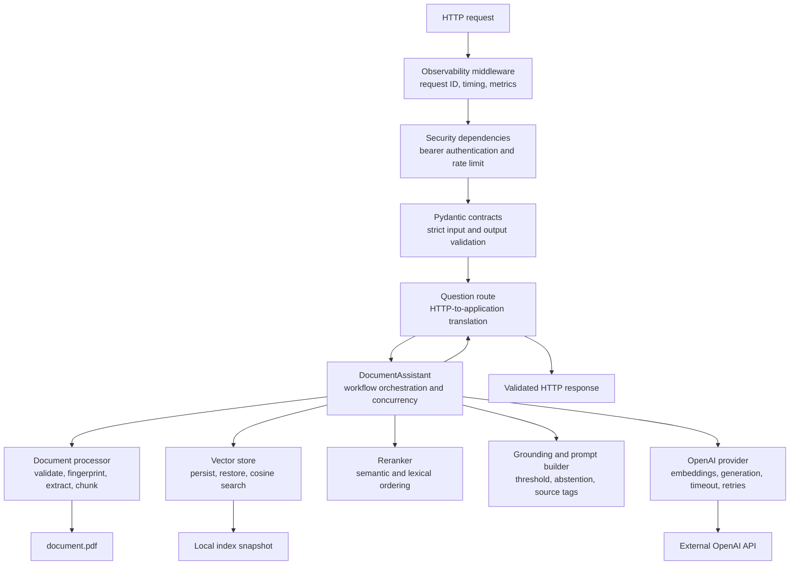

# C4 Level 3 — FastAPI Backend Component View

## Scope

This view zooms into the FastAPI backend container. Components are logical
responsibility groups inside one process; they are not separately deployable
services.

## Diagram

## Application Factory and Routes

Module: `app.main`

Responsibilities:

- construct the application from explicit settings and services;
- initialize and close the assistant during lifespan events;
- expose health, readiness, metrics, and question routes;
- wire dependencies;
- translate domain errors to HTTP responses.

It does not implement retrieval algorithms or provider SDK calls.

## Configuration

Module: `app.config`

Responsibilities:

- load environment variables and `.env`;
- hide secrets through `SecretStr`;
- validate numeric ranges and allowed environment values;
- validate relationships such as overlap smaller than chunk size;
- reject placeholder credentials at startup.

## API Contracts

Module: `app.models`

Responsibilities:

- reject unknown fields;
- use strict type validation;
- normalize the question;
- define source, answer, health, readiness, and metrics response shapes.

These are application contracts. The LLM answer itself remains plain text.

## Security and Admission

Module: `app.security`

Responsibilities:

- parse bearer credentials;
- compare keys with `secrets.compare_digest()`;
- hash the credential before using it as a limiter identifier;
- maintain a locked sliding request window;
- return `429` with `Retry-After` when admission is denied.

## Observability

Module: `app.observability` plus middleware in `app.main`

Responsibilities:

- assign a UUID request ID;
- correlate logs through a context variable;
- emit one JSON object per log line;
- record request counts, active requests, errors, rate limiting, and average
  duration;
- emit privacy-safe retrieval metadata.

Questions, answers, source text, prompts, authorization headers, and secrets are
not logged.

## RAG Orchestrator

Module: `app.services.rag`

Responsibilities:

- coordinate index initialization and restoration;
- hold the question concurrency semaphore;
- embed the question;
- retrieve candidates;
- invoke reranking;
- apply the evidence threshold;
- build the grounded prompt;
- generate or abstain;
- return sources with the answer.

## Document Processor

Module: `app.services.document`

Responsibilities:

- validate file existence and byte limit;
- fingerprint the document;
- enforce page limit;
- extract text and add page markers;
- create overlapping, boundary-aware chunks.

## Vector Store

Module: `app.services.vector_store`

Responsibilities:

- validate chunk/vector alignment;
- hold the active index in memory;
- calculate cosine similarities;
- return ranked semantic candidates;
- atomically persist the local snapshot;
- reject incompatible or corrupt snapshots as cache misses.

## Reranker

Module: `app.services.reranker`

Responsibilities:

- tokenize question and candidate text;
- combine semantic similarity with lexical overlap;
- choose and renumber the final `TOP_K` sources.

## OpenAI Provider

Module: `app.services.openai_provider`

Responsibilities:

- own the async SDK client;
- create embeddings;
- call the Responses API;
- apply configured timeout and bounded retries;
- translate OpenAI errors into application errors;
- close the client at shutdown.

## Deliberate Component Boundary

Document search is not exposed to the model as a function tool. The orchestrator
invokes it deterministically because every question must follow the same search
path.

Continue with the [Code View](c4-code.md) for exact modules, classes, and
dependency rules.
