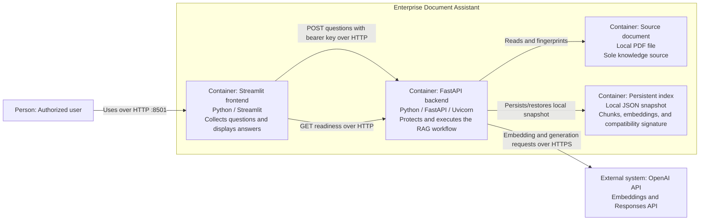

# C4 Level 2 — Container View

## Scope

This view shows the running applications and data stores that make up the
Enterprise Document Assistant.

## Diagram

## Streamlit Frontend

Technology: Python, Streamlit, HTTPX, Pydantic Settings.

Responsibilities:

- collect one question;
- check basic UX constraints before submission;
- call the backend with `APP_API_KEY`;
- show readiness, answer, request ID, and sources;
- translate common backend status codes into useful messages.

It never receives or calls OpenAI with `OPENAI_API_KEY`.

## FastAPI Backend

Technology: Python, FastAPI, Uvicorn, Pydantic, OpenAI SDK, scikit-learn,
PyPDF.

Responsibilities:

- own the HTTP and lifecycle boundary;
- validate configuration and request/response contracts;
- authenticate and rate-limit clients;
- control simultaneous expensive workflows;
- initialize or restore the document index;
- orchestrate retrieval, reranking, grounding, and generation;
- translate domain failures into stable HTTP errors;
- emit request IDs, JSON logs, retrieval traces, and metrics.

## Source Document

Technology: local text-based PDF.

The PDF is packaged or mounted as a deployment artifact. The backend validates
its byte size and page count before processing it.

## Persistent Index

Technology: local JSON file under `.data/`.

The snapshot contains:

- schema version;
- document/settings signature;
- extracted chunks;
- embedding vectors.

Search still runs in memory. The JSON file exists to avoid re-embedding an
unchanged document after restart. It is not a shared vector database.

## OpenAI API

External provider for:

- `text-embedding-3-small` by default;
- the configured generation model through the Responses API.

All backend SDK access is isolated inside `OpenAIProvider`.

## Communication Summary

| From | To | Protocol | Data |
| --- | --- | --- | --- |
| Browser | Streamlit | HTTP | page events and question text |
| Streamlit | FastAPI | HTTP/JSON | bearer key, question, response |
| FastAPI | OpenAI | HTTPS/JSON | chunks, question, grounded prompt, model outputs |
| FastAPI | PDF | local file I/O | document bytes and extracted text |
| FastAPI | index | local file I/O | compatibility signature, chunks, embeddings |

## Scaling Boundary

Each backend process owns its rate limiter, semaphore, metrics, in-memory index,
and JSON snapshot access. Multiple replicas require coordinated controls and
shared storage; the current container view does not claim that capability.

Continue with the [Component View](c4-component.md) to inspect the backend's
internal responsibilities.
