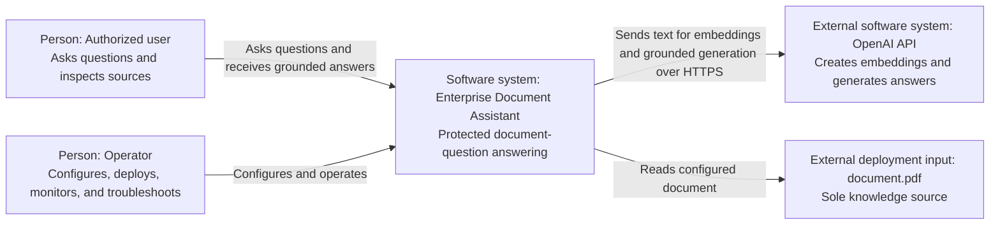

# C4 Level 1 — System Context

## Scope

The Enterprise Document Assistant lets an authorized user ask questions about
one configured PDF and receive answers grounded in retrieved document evidence.

## Diagram

## People

### Authorized user

- uses the Streamlit interface or HTTP API;
- asks questions about the configured document;
- receives a generated answer or abstention;
- inspects source chunks and similarity signals;
- can report a request ID when something fails.

“Authorized” means the client holds the shared application API key. V3 does not
identify individual human users.

### Operator

- supplies secrets and configuration;
- selects the document;
- starts or deploys the services;
- uses health, readiness, metrics, logs, and request IDs;
- responds to failures and invalidates the index when necessary;
- owns the decision to change limits, models, or deployment infrastructure.

## External Systems and Inputs

### OpenAI API

The backend uses OpenAI for two operations:

- convert document chunks and questions into embedding vectors;
- generate an answer from the grounded prompt.

OpenAI is a network dependency outside this system's availability boundary.

### Configured PDF

The PDF is a deployment-controlled input and the only knowledge source. It is
not uploaded by end users in V3.

## System Responsibilities

The Document Assistant owns:

- frontend experience;
- HTTP contract;
- validation and application authentication;
- resource controls;
- PDF extraction and chunking;
- index creation and local persistence;
- semantic retrieval, reranking, and grounding;
- prompt construction and provider integration;
- responses, sources, logs, metrics, tests, and operating documentation.

## Outside the Boundary

- OpenAI platform availability and billing;
- enterprise identity and single sign-on;
- managed vector infrastructure;
- OCR;
- multi-document ingestion;
- cloud networking, TLS, domain, and secret store;
- human verification of the source document's correctness.

## Intended Audience

This view is the starting point for everyone. Continue with the
[Container View](c4-container.md) to see the running applications and data
stores inside the system.
