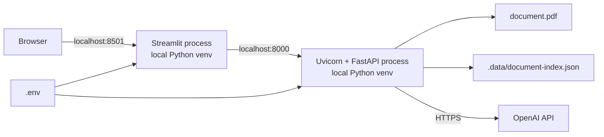
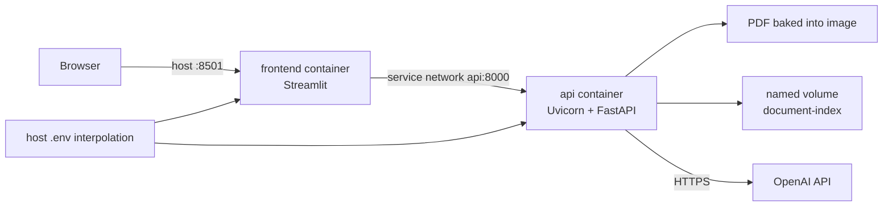
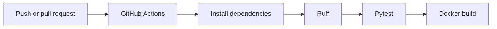

# Deployment View

## Local Development

Two terminals run two processes. Both read `.env`, but only the backend uses the
OpenAI key.

## Docker Compose

Both services use the same image but different commands. The image runs as a
non-root `app` user. Compose waits for the API health check before starting the
frontend.

## Build Pipeline

CI does not call OpenAI, load real secrets, or deploy to a cloud provider.

## Runtime State

| State | Location | Persistence |
| --- | --- | --- |
| Source PDF | image/local working directory | deployment artifact |
| Active chunks and vectors | backend memory | lost on process exit |
| Vector snapshot | `.data/document-index.json` or named volume | survives compatible restart |
| Rate-limit windows | backend memory | reset on process exit |
| Metrics counters | backend memory | reset on process exit |
| Request logs | standard output | retained only if an external platform collects them |
| Secrets | process environment | managed outside image and Git |

## Production Platform Requirements

The image is deployable, but a real hosted environment must still decide:

- TLS termination and domain ownership;
- secret storage and rotation;
- container registry;
- network egress to OpenAI;
- log and metrics collection;
- snapshot persistence and backup;
- health/readiness integration;
- scaling and per-replica behavior;
- rollback procedure;
- data retention and document licensing.

Those choices are environment-specific and should be recorded in new ADRs rather
than hardcoded into the reusable V3 foundation.
