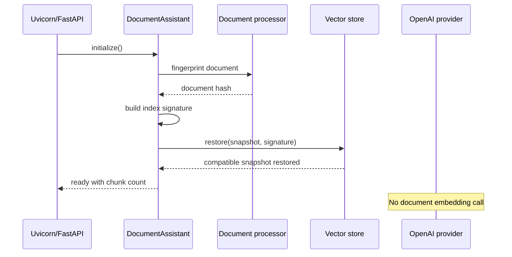
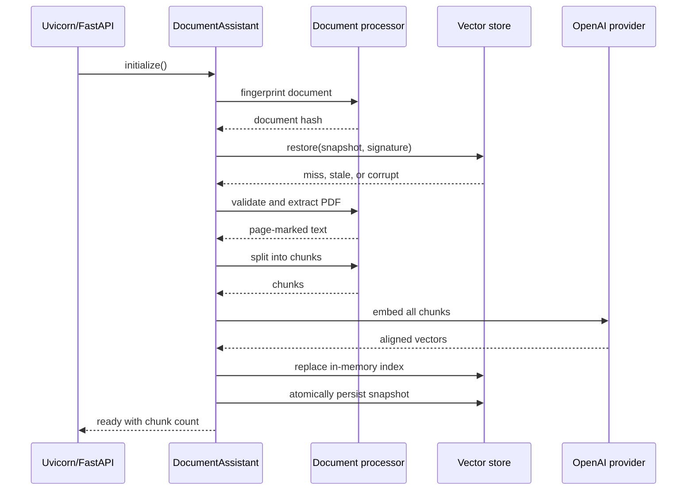
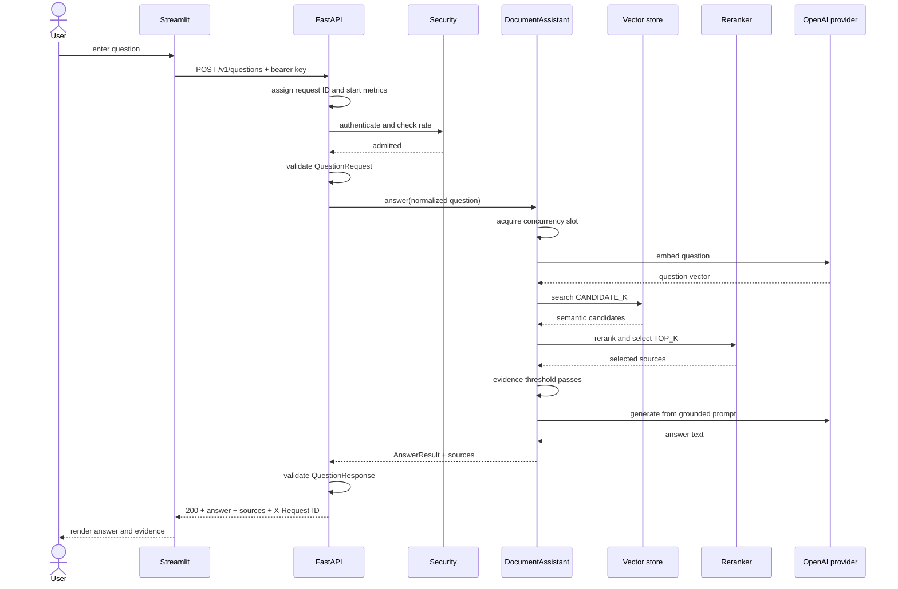
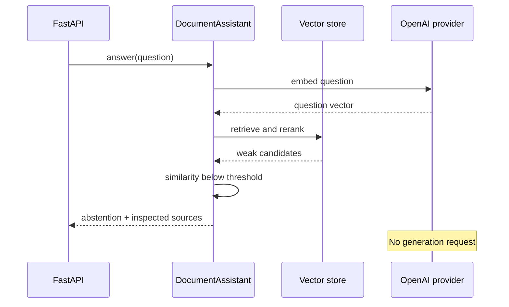
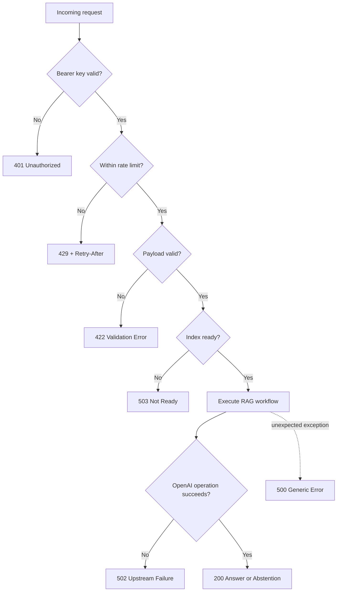

# Request and Startup Lifecycles

## Why a Dynamic View Is Needed

C4 views show what exists. This document shows when components act and where a
request can stop.

## Startup: Compatible Snapshot

## Startup: Cache Miss or Changed Document

## Successful Question

## Unsupported Question

## Failure Branches

## Observability Along the Path

Every branch receives an `X-Request-ID`. The middleware records total duration
and final status. Retrieval logs add candidate/selection metadata when the
workflow reaches that stage.

Because content is intentionally omitted from logs, operators use the request
ID plus returned sources and user-reported question context during diagnosis.
