# The RAG Pipeline, Step by Step

## Purpose

This document traces the actual V3 implementation from PDF to answer. It
separates indexing from question answering because they have different costs,
failure modes, and operating behavior.

## The Two Lifecycles

```mermaid
flowchart TB
    subgraph Indexing["Indexing lifecycle — startup or changed document"]
        PDF["document.pdf"] --> EX["Extract text"]
        EX --> CH["Create overlapping chunks"]
        CH --> EMB["Create chunk embeddings"]
        EMB --> IDX["Load in-memory vector index"]
        IDX --> SNAP["Persist fingerprinted JSON snapshot"]
    end

    subgraph Query["Question lifecycle — every accepted question"]
        Q["Question"] --> QE["Create question embedding"]
        QE --> RET["Retrieve candidates"]
        RET --> RR["Rerank and select sources"]
        RR --> GATE{"Evidence sufficient?"}
        GATE -->|"No"| ABS["Return abstention"]
        GATE -->|"Yes"| PROMPT["Build grounded prompt"]
        PROMPT --> LLM["Generate answer"]
        LLM --> OUT["Return answer and sources"]
    end
```



## Lifecycle A: Build or Restore the Index

### 1. Validate the PDF

Code: `app/services/document.py`

The service verifies that the configured path exists and that the byte size is
within `MAX_DOCUMENT_BYTES` before hashing or parsing it.

Why: parsing an unexpected or extremely large input can waste memory, startup
time, and API credit.

### 2. Fingerprint the document

The PDF bytes are hashed with SHA-256. The final index signature also includes:

- embedding model;
- chunk size;
- chunk overlap;
- byte limit;
- page limit.

Why: a persisted index is valid only for the exact document and settings that
created it.

### 3. Attempt snapshot restore

Code: `app/services/vector_store.py`

The local JSON snapshot is accepted only when:

- the schema version matches;
- the index signature matches;
- chunks and embeddings have valid shapes.

A missing, corrupt, stale, or incompatible snapshot is treated as a cache miss.
It is rebuilt instead of crashing the application.

### 4. Extract PDF text

`pypdf` reads up to `MAX_DOCUMENT_PAGES`. Each extracted page receives a marker:

```text
--- Page 3 ---
<page text>
```

Why: page markers preserve a small amount of source structure after extraction.

### 5. Create chunks

`split_text()` creates bounded character chunks and prefers natural boundaries
in this order:

1. paragraph;
2. sentence;
3. line;
4. word;
5. hard character boundary.

Chunks overlap so evidence near a cut is less likely to disappear between
retrieval units.

### 6. Embed all chunks

Code: `app/services/openai_provider.py`

The chunk strings are sent as one batch to the configured embedding model.
Returned vectors are sorted by their response index so they remain aligned with
the original chunks.

### 7. Load the in-memory index

`InMemoryVectorStore.replace()` validates that:

- at least one chunk exists;
- every chunk has one vector;
- no vector is empty;
- all vectors have the same dimensions.

### 8. Persist the snapshot atomically

The service writes a temporary JSON file, then replaces the configured snapshot
path with `os.replace()`.

Why: readers should see either the old complete snapshot or the new complete
snapshot, not a partially written file.

## Lifecycle B: Answer a Question

### 1. Accept only ready work

`DocumentAssistant.answer()` rejects requests if the vector store is not ready.
FastAPI translates that domain failure into a stable `503` response.

### 2. Acquire a concurrency slot

An `asyncio.Semaphore` limits the number of simultaneous question workflows.
The protected section includes query embedding and answer generation—the costly
external operations.

### 3. Embed the question

The question uses the same embedding model as the document chunks.

Why: cosine similarity only has meaning when the compared vectors belong to the
same representation space.

### 4. Retrieve semantic candidates

`InMemoryVectorStore.search()`:

1. compares the question vector with every stored chunk vector;
2. calculates cosine similarity;
3. sorts from highest to lowest;
4. returns up to `CANDIDATE_K` passages.

This first stage prioritizes recall: collect a useful shortlist before being
selective.

### 5. Rerank candidates

Code: `app/services/reranker.py`

The deterministic reranker combines:

```text
85% semantic similarity
15% question-token overlap
```

It then keeps `TOP_K` sources.

Why not use another LLM: the current corpus is tiny and the inspectable rule is
fast, cheap, deterministic, and easy to test. A learned reranker should be added
only after evaluation shows this rule is insufficient.

### 6. Evaluate evidence sufficiency

The top selected source's semantic similarity is compared with
`MINIMUM_SIMILARITY_SCORE`.

```text
score below threshold -> abstain before generation
score at/above threshold -> continue
```

The threshold is a heuristic calibrated against the current document. It is not
a universal truth and must be reevaluated when the corpus changes.

### 7. Build the grounded prompt

Code: `build_prompt()` in `app/services/rag.py`

The prompt:

- limits the answer to document sources;
- prohibits outside knowledge;
- treats source text as untrusted evidence, not instructions;
- defines the exact abstention response;
- asks for concise plain language;
- requires `[Source N]` labels.

Each source is placed inside an explicit tag:

```xml
<source id="1" chunk="5">
Retrieved document evidence...
</source>
```

### 8. Generate the answer

`OpenAIProvider.generate_answer()` sends the complete prompt through the OpenAI
Responses API using the configured generation model.

The provider:

- applies a timeout;
- configures bounded SDK retries;
- converts OpenAI failures into `UpstreamServiceError`;
- rejects an empty answer.

### 9. Return structured application output

The LLM returns text, but the application returns a strict Pydantic response:

```json
{
  "request_id": "...",
  "answer": "... [Source 1].",
  "sources": [
    {
      "source_number": 1,
      "chunk_number": 5,
      "similarity": 0.65,
      "text": "..."
    }
  ]
}
```

This is structured application output. It is not OpenAI Structured Outputs: the
answer text itself is not generated against a JSON schema.

## What Gets Logged

The retrieval trace includes:

- candidate count;
- candidate chunk numbers;
- selected chunk numbers;
- semantic similarity values;
- evidence sufficiency decision;
- retrieval duration.

It deliberately excludes:

- the question;
- prompt;
- document passages;
- generated answer;
- credentials.

## Cost Model

### First startup or invalidated snapshot

- embed all document chunks;
- no generation request.

### Compatible restart

- restore local snapshot;
- no document embedding request.

### Supported question

- one question embedding request;
- one generation request.

### Weak-evidence question

- one question embedding request;
- no generation request when the threshold rejects evidence.

## Failure Diagnosis by Stage

| Symptom | Likely stage |
| --- | --- |
| Startup rejects PDF | validation or extraction |
| Startup calls embeddings every time | fingerprint or snapshot compatibility |
| Correct passage never appears | chunking, embedding, or candidate retrieval |
| Correct passage appears but wrong one is first | reranking |
| Unrelated question gets an answer | threshold or grounding |
| Correct sources but poor prose | prompt or generation |
| `502` response | OpenAI provider or network |

## What V3 Does Not Do

- OCR for scanned documents;
- multiple-document ingestion;
- metadata filtering;
- a shared managed vector database;
- a learned cross-encoder reranker;
- independently verified citation entailment;
- conversational memory;
- model-controlled tool selection.

Each is a possible future capability, not a requirement for understanding the
current RAG system.
