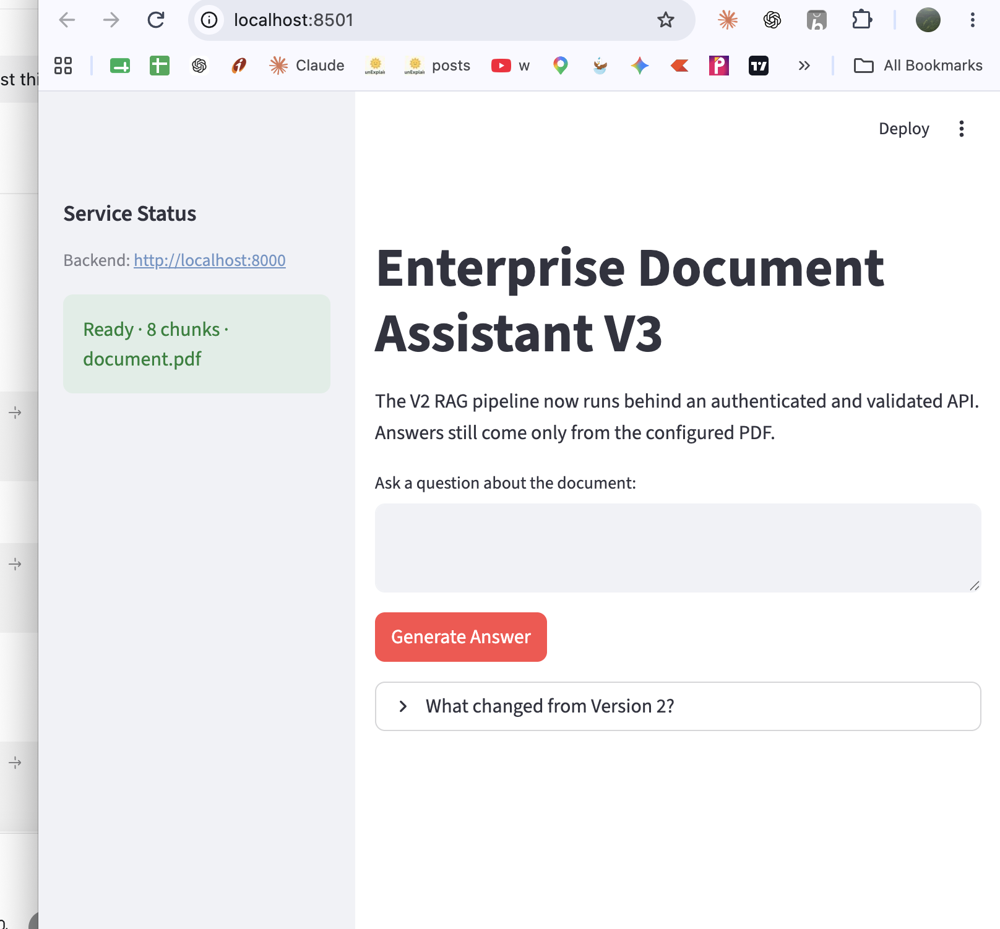
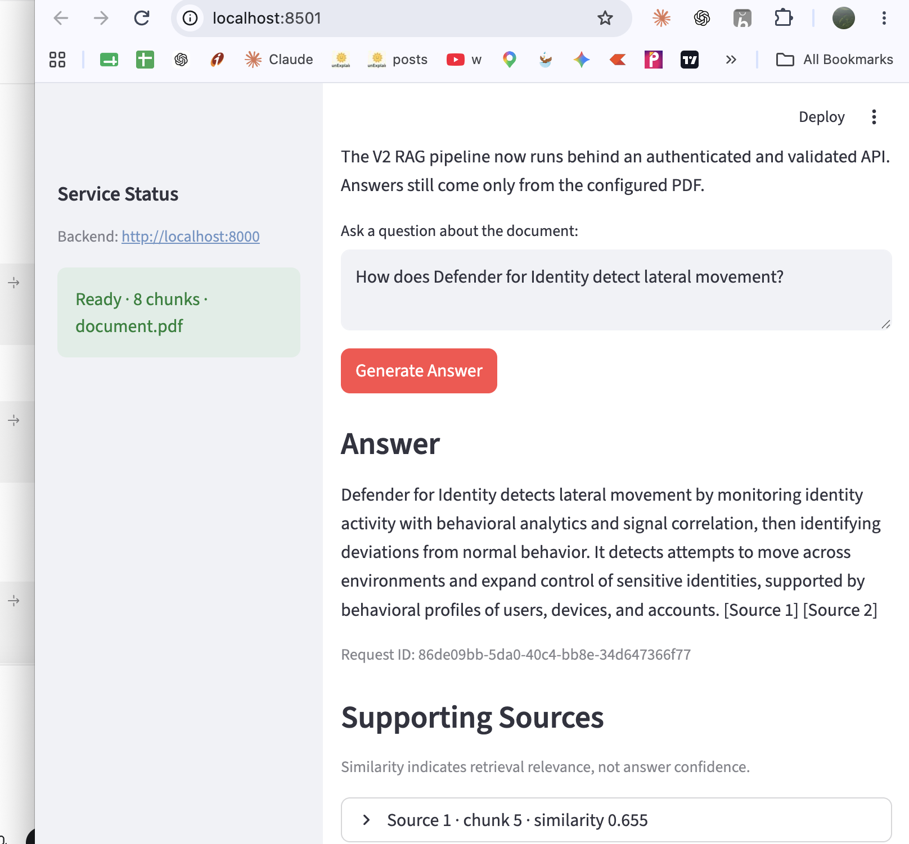
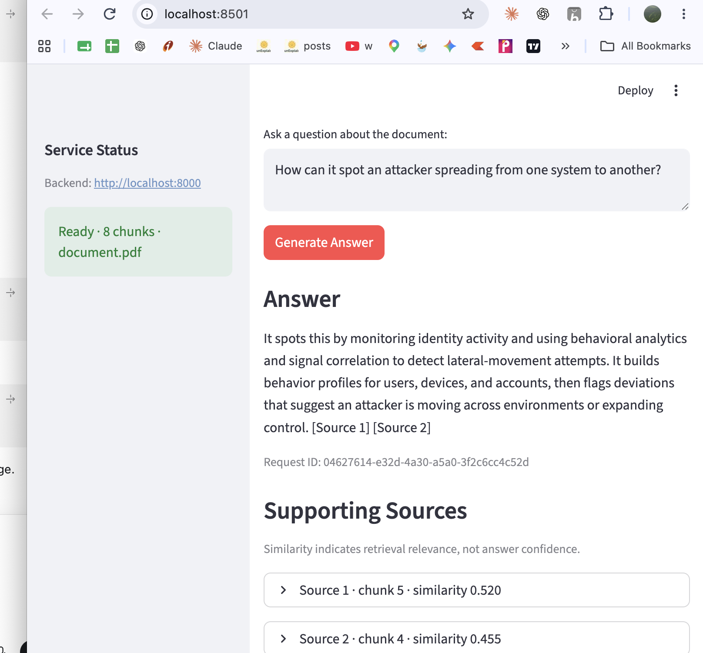
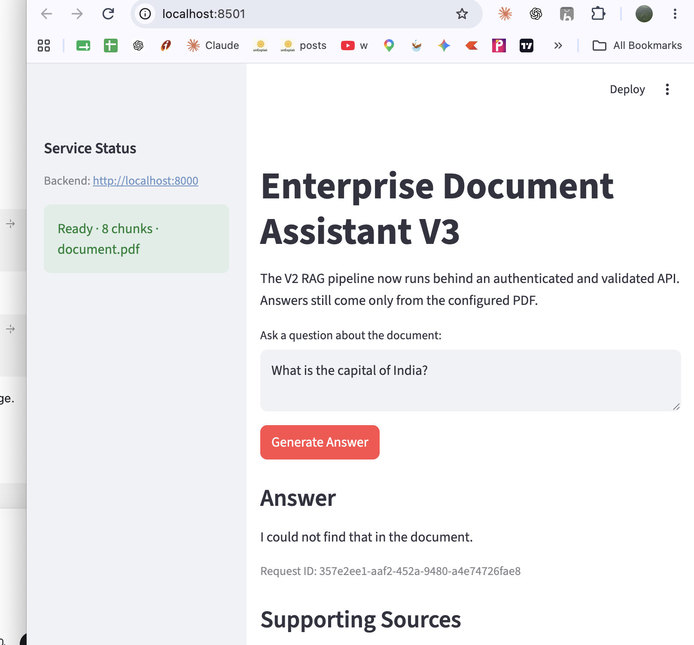
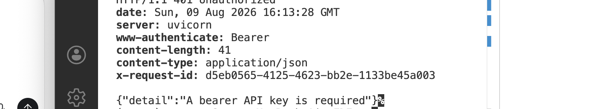

# Version 3 — Manual Enterprise Validation

## Purpose

This record captures the first manual validation of Version 3. It verifies that
the Version 2 RAG behavior still works after placing it behind the Version 3
production boundary:

```text
Streamlit client → authenticated FastAPI API → validated request → V2 RAG pipeline
```

This is qualitative smoke-test evidence, not a performance, load, or security
assessment.

## Test Setup

- Date: 2026-08-09
- Application: Enterprise Document Assistant V3, running locally
- Frontend: Streamlit on port 8501
- Backend: FastAPI/Uvicorn on port 8000
- Knowledge source: configured four-page Microsoft Defender for Identity PDF
- Indexed document chunks: 8
- Retrieval: `text-embedding-3-small`, cosine similarity, top 3 chunks
- Generation: `gpt-5.6-terra`

## Results

| Test | Capability | Observed result | Outcome |
| --- | --- | --- | --- |
| 1 | Service readiness | Frontend reported `Ready`, `8 chunks`, and `document.pdf`. | Pass |
| 2 | Direct document question | Generated a grounded, cited answer; top visible similarity was 0.655. | Pass |
| 3 | Semantic paraphrase | Understood "spreading from one system to another" as lateral movement; top visible similarity was 0.520. | Pass |
| 4 | Unsupported question | Responded `I could not find that in the document.` | Pass |
| 5 | Liveness endpoint | `GET /health` returned `status: ok` and version `3.0.0`. | Pass |
| 6 | Readiness endpoint | `GET /ready` reported `document.pdf` and 8 indexed chunks. | Pass |
| 7 | Authentication boundary | A protected request without a bearer key returned `401 Unauthorized`. | Pass |

## Test 1 — Service Readiness

The frontend successfully contacted the backend, and the readiness check
confirmed that the configured document index was available.



## Test 2 — Direct Question

Question:

```text
How does Defender for Identity detect lateral movement?
```

The API returned a document-grounded answer, source citations, retrieved chunks,
similarity scores, and a request ID for tracing.



## Test 3 — Paraphrased Question

Question:

```text
How can it spot an attacker spreading from one system to another?
```

The question did not contain the phrase `lateral movement`, but semantic
retrieval still found relevant document chunks and generated a grounded answer.



## Test 4 — Unsupported Question

Question:

```text
What is the capital of India?
```

The assistant abstained instead of answering from general model knowledge. The
response also included a request ID, allowing the request to be correlated with
backend logs.



## Test 5 — Liveness

`GET /health` proved that the API process was alive and exposing Version 3.0.0.


## Test 6 — Readiness

`GET /ready` proved that the API was not merely running: its eight-chunk document
index was initialized and ready to answer questions.


## Test 7 — Authentication

A request to the protected question endpoint without an application bearer key
returned `401 Unauthorized`, a `WWW-Authenticate: Bearer` header, and an
`X-Request-ID` header.



## Findings

1. V3 preserved the direct, paraphrased, and unsupported-question behavior
   demonstrated by V2.
2. The frontend is now an API client; readiness is independently visible through
   both the UI and the backend contract.
3. Request IDs make successful and rejected requests traceable across the UI,
   HTTP response, and structured backend logs.
4. The authentication boundary rejected an unauthenticated request before it
   could invoke the costly RAG pipeline.

## Remaining Validation

Automated tests cover validation, rate limiting, metrics, concurrency controls,
and error handling. This manual session did not capture evidence for a `422`
validation response, a `429` rate-limit response, load behavior, container
startup, or deployment to an external platform.
