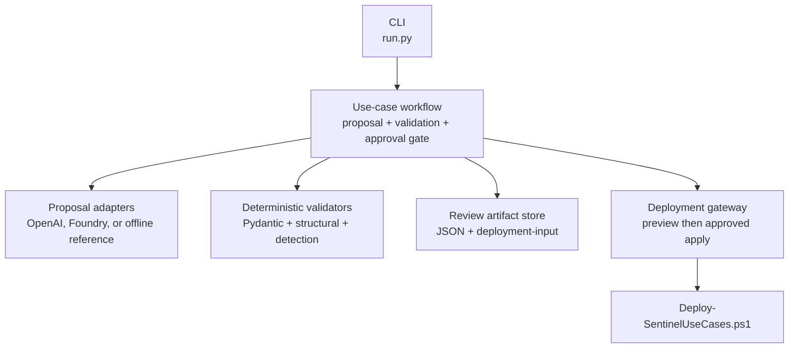

# C4: Container view

```mermaid
flowchart TB
    cli[CLI\nrun.py]
    workflow[Use-case workflow\nproposal + validation + approval gate]
    proposer[Proposal adapters\nOpenAI, Foundry, or offline reference]
    validator[Deterministic validators\nPydantic + structural + detection]
    artifact[Review artifact store\nJSON + deployment-input]
    gateway[Deployment gateway\npreview then approved apply]
    powershell[Deploy-SentinelUseCases.ps1]

    cli --> workflow
    workflow --> proposer
    workflow --> validator
    workflow --> artifact
    workflow --> gateway
    gateway --> powershell
```

V1 exposes the workflow through the CLI. A future web interface can reuse the same workflow without
changing validation or approval rules.
