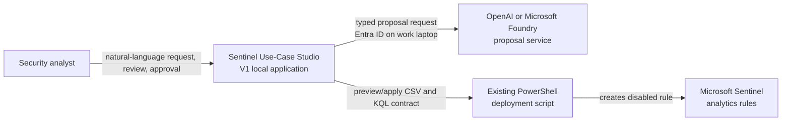

# C4: System context

```mermaid
flowchart LR
    analyst[Security analyst]
    system[Sentinel Use-Case Studio\nV1 local application]
    openai[OpenAI or Microsoft Foundry\nproposal service]
    sentinel[Microsoft Sentinel\nanalytics rules]
    script[Existing PowerShell\ndeployment script]

    analyst -->|natural-language request, review, approval| system
    system -->|typed proposal request\nEntra ID on work laptop| openai
    system -->|preview/apply CSV and KQL contract| script
    script -->|creates disabled rule| sentinel
```

The application owns proposal validation and approval gates. The external deployment script owns
the final Sentinel API interaction.
